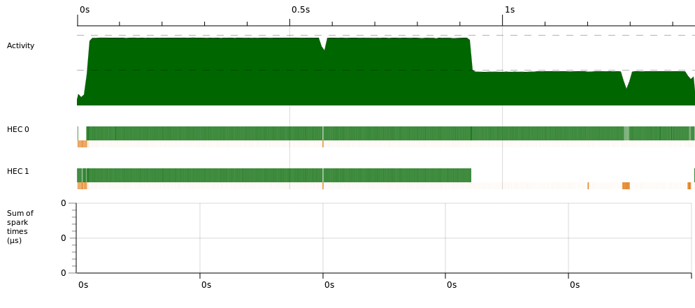
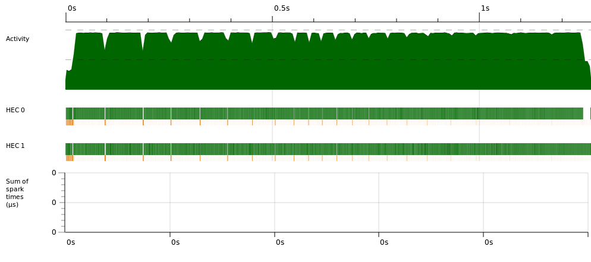
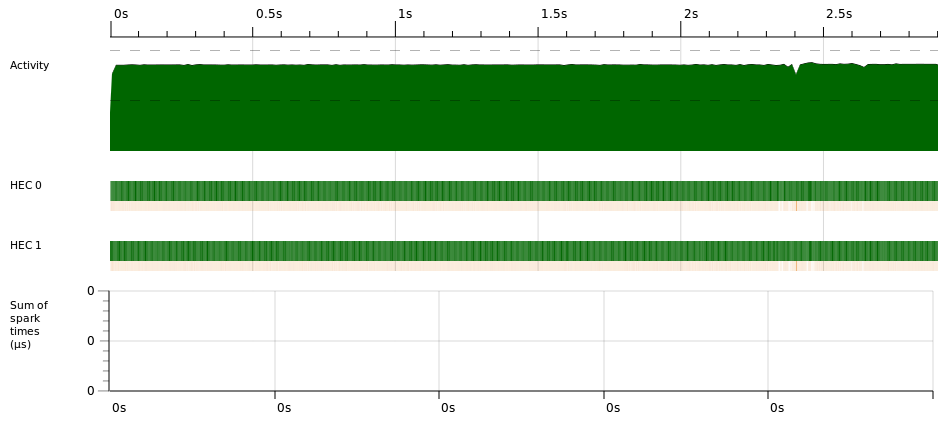
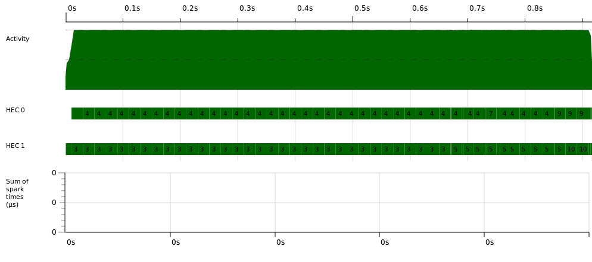

% Advanced functional programming
% Marcin Benke
% Parallelism and Concurrency

# Parallelism vs concurrency

A *parallel* program is one that uses a multiplicity of computational
hardware (e.g. multiple processor cores) in order to perform
computation more quickly.  Different parts of the computation are
delegated to different processors that execute at the same time (in
parallel), so that results may be delivered earlier than if the
computation had been performed sequentially.

In contrast, *concurrency* is a program-structuring technique in which
there are multiple threads of control. Notionally the threads of
control execute "at the same time"; that is, the user sees their
effects interleaved. Whether they actually execute at the same time or
not is an implementation detail; a concurrent program can execute on a
single processor through interleaved execution, or on multiple
physical processors. 

--- [Simon Marlow, *Parallel and Concurrent Programming in Haskell*](http://chimera.labs.oreilly.com/books/1230000000929)

(recommended reading, free to read online)

# Haskell parallelism

* Parallel programs in Haskell are *deterministic*
* The same pure program gives the same answer on 1 and N cores
* Programs can be debugged on 1 core
* No risk of deadlock or race conditions
* No need to worry about thread communication and synchronisation.

# Sudoku

An example with lots of computation: solving Sudoku

Every line of input contains an instance of the problem

Sequential program:

~~~~ {.haskell}
main = do
    [f] <- getArgs
    grids <- fmap lines $ readFile f
    mapM_ (evaluate . solve) grids
~~~~

~~~~
$ ghc -O2 -threaded --make sudoku1.hs
$ ./sudoku1 sudoku17.1000.txt +RTS -s
  TASKS: 3 (1 bound, 2 peak workers (2 total), using -N1)
  SPARKS: 0 (0 converted, 0 overflowed, 0 dud, 0 GC'd, 0 fizzled)

  Total   time    2.53s  (  2.56s elapsed)
  Alloc rate    973,110,877 bytes per MUT second
  Productivity  96.0% of total user, 94.9% of total elapsed
~~~~

# Multicore?

Meet Azor: 64 cores, 64GB mem

~~~~
$ ghc -O2 -threaded --make sudoku1.hs
$ ./sudoku1 sudoku17.1000.txt +RTS -s
  TASKS: 3 (1 bound, 2 peak workers (2 total), using -N1)
  SPARKS: 0 (0 converted, 0 overflowed, 0 dud, 0 GC'd, 0 fizzled)

  Total   time    2.53s  (  2.56s elapsed)
  Productivity  96.0% of total user, 94.9% of total elapsed
~~~~

~~~~
$ ./sudoku1 sudoku17.1000.txt +RTS -s -N16
  TASKS: 18 (1 bound, 17 peak workers (17 total), using -N16)
  SPARKS: 0 (0 converted, 0 overflowed, 0 dud, 0 GC'd, 0 fizzled)

  Total   time   16.84s  (  4.09s elapsed)
  Productivity  51.8% of total user, 213.1% of total elapsed
~~~~

Our program works slower - we unnecessarily start N-1 additional threads that only get in the way.

# The `Eval` monad - computation strategies

~~~~ {.haskell}
-- Control.Parallel.Strategies
data Eval a
instance Monad Eval

runEval :: Eval a -> a
rseq :: a -> Eval a  -- "in this thread"
rpar :: a -> Eval a  --  "in a new thread"
~~~~

Calling a lazy function in a new thread has not much sense (why?)

We need to control the evaluation somehow.

# deepseq & friends

deepseq: fully evaluates the first argument, before returning the second.

~~~~ {.haskell}
seq :: a -> b -> b
-- Control.DeepSeq
class NFData a where
    rnf :: a -> ()
-- rnf should reduce its argument to normal form 
-- (that is, fully evaluate all sub-components), 
-- and then return '()'

-- Default implementation
    rnf a = a `seq` ()

deepseq :: NFData a => a -> b -> b
deepseq a b = rnf a `seq` b

force ::  NFData a => a -> a
force x = deepseq x x

-- Control.Exception
-- Forces its argument to be evaluated to weak head normal form 
-- when the resultant IO action is executed.
evaluate :: a -> IO a
~~~~

# deepseq & friends

`seq` forces ``shallow'' evaluation (just the root)

`deepseq` forces the  whole tree up to the leaves.

```
> let x = [undefined] :: [Int] in x `seq` length x
1

> let x = [undefined] :: [Int] in x `deepseq` length x
*** Exception: Prelude.undefined
```

# A parallel program

~~~~ {.haskell}
import Control.Parallel.Strategies  -- cabal install parallel
main = do
    [f] <- getArgs
    grids <- fmap lines $ readFile f

    let (as,bs) = splitAt (length grids `div` 2) grids

    evaluate $ runEval $ do
       a <- rpar (force (map solve as))
       b <- rpar (force (map solve bs))
       rseq a
       rseq b
       return ()
~~~~

We create two light threads, in GHC called ``sparks'' (these are not OS threads).


# Results

~~~~
$ ghc -O2 -rtsopts -threaded --make sudoku2.hs
$ ./sudoku2 sudoku17.1000.txt +RTS -N2 -s -RTS

  TASKS: 4 (1 bound, 3 peak workers (3 total), using -N2)
  SPARKS: 2 (1 converted, 0 overflowed, 0 dud, 0 GC'd, 1 fizzled)

  Total   time    2.73s  (  1.77s elapsed)
  Productivity  91.1% of total user, 140.4% of total elapsed
~~~~

Better, but we are still unavble to use the whole power:

```
./sudoku2 sudoku17.1000.txt +RTS -N16 -s -RTS

  TASKS: 18 (1 bound, 17 peak workers (17 total), using -N16)
  SPARKS: 2 (1 converted, 0 overflowed, 0 dud, 0 GC'd, 1 fizzled)

  Total   time   15.12s  (  3.19s elapsed)
  Productivity  55.2% of total user, 261.7% of total elapsed
```

# Sparks

* A new spark is created with each use of `rpar` (and put in the spark pool)

* Whenever the system has a free computational unit (processor, core), it allocates it a new spark from the pool ("convert")

* Computational unit - Haskelll Execution Context (HEC)

* One unit always occupied by the main thread.

Spark creation may fail due to

* pool overflow

* expression in WHNF already (dud)

# Spark pool

sparks in the pool may be

* "converted" (allocated a HEC)

* evaluated out of order (fizzle)

* garbage collected (GC)

# 


# sudoku2.hs
~~~~
  SPARKS: 2 (1 converted, 0 overflowed, 0 dud, 0 GC'd, 1 fizzled)

  Total   time    2.73s  (  1.77s elapsed)

  Productivity  91.1% of total user, 140.4% of total elapsed
~~~~

Productivity better, but still far from ideal.

# Threadscope

* A tool to analyse threaded program execution
* `ghc -eventlog`
* executing program `prog' yields `prog.eventlog`

~~~~
$ ./sudoku2 sudoku17.1000.txt +RTS -N2 -ls
$ threadscope sudoku2.eventlog &
$ ~/.cabal/bin/threadscope sudoku2.eventlog &
~~~~

# Threadscope - sudoku2



# Dynamic work allocation

Parallel map: process list elements in parallel

~~~~ {.haskell}
parMap :: (a -> b) -> [a] -> Eval [b]
parMap f [] = return []
parMap f (a:as) = do
   b <- rpar (f a)
   bs <- parMap f as
   return (b:bs)
~~~~

Evaluation:

~~~~ {.haskell}
    runEval (parMap solve grids) `deepseq` return ()
~~~~

# parMap - results

~~~~
$ ./sudoku3b sudoku17.1000.txt +RTS -N2 -s -RTS
  TASKS: 4 (1 bound, 3 peak workers (3 total), using -N2)
  SPARKS: 1000 (1000 converted, 0 overflowed, 0 dud, 0 GC'd, 0 fizzled)

  Total   time    2.84s  (  1.49s elapsed)
  Productivity  88.9% of total user, 169.6% of total elapsed
~~~~

Better productivity, easier to scale:

~~~~
sudoku2b 
-N8: Productivity  71.0% of total user, 169.2% of total elapsed
N16: Productivity  53.5% of total user, 252.6% of total elapsed

sudoku3b 
-N8: Productivity  78.5% of total user, 569.3% of total elapsed
N16: Productivity  62.8% of total user, 833.8% of total elapsed
N32: Productivity  43.5% of total user, 1112.6% of total elapsed
~~~~

# Threadscope - sudoku3



# Threadscope - sudoku3 -N8


# Strategie

Additional abstraction layer built upon the `Eval` monad

~~~~ {.haskell}
type Strategy a = a -> Eval 
rseq :: Strategy a
rpar :: Strategy a
r0 :: Strategy a
r0 x = return x
rdeepseq :: NFData a => Strategy a
rdeepseq = rseq(deep x)

using :: a -> Strategy a -> a
x `using` s = runEval (s x)
~~~~

The advantage is that  `using s` can be removed (almost) without changing semantics
(at worst, the program will be ``more defined'')

# Parallel list processing

~~~~ {.haskell}
parMap f xs = map f xs `using` parList rseq

-- Control.Parallel.Strategies
parList :: Strategy a -> Strategy [a]
parList strat [] = return []
parList strat (x:xs) = do
	x' <- rpar (x `using` strat)
	xs' <- parList strat xs
	return (x':xs)
~~~~

# Cautionary note

Although the sparks are really cheap, one should not create too many of them

~~~~ {.haskell}
parFib n | n < 2 = n
parFib n = p `par` q `pseq` (p + q)
    where
      p = parFib $ n - 1
      q = parFib $ n - 2

main :: IO ()
main = print $ parFib 40
~~~~

~~~~
@azor:
./badfib +RTS -N2 -s -RTS
  SPARKS: 165597322 (16 converted, 14860689 overflowed, 0 dud, 
                     150628741 GC'd, 107876 fizzled)
  Total   time    7.18s  (  3.65s elapsed)
  Productivity  71.8% of total user, 141.5% of total elapsed

N60:
 SPARKS: 190193153 (61919 converted, 2556576 overflowed, 0 dud, 
                    140401503 GC'd, 47173155 fizzled)
  Total   time   65.95s  (  1.28s elapsed)
  Productivity  47.8% of total user, 2461.5% of total elapsed
~~~~

# Spark lifecycle


# Better

~~~~ {.haskell}
cutoff :: Int
cutoff = 20

parFib n | n < cutoff = fib n
parFib n = p `par` q `pseq` (p + q)
    where
      p = parFib $ n - 1
      q = parFib $ n - 2

fib n | n<2 = n
fib n = fib (n - 1) + fib (n - 2)
~~~~

~~~~
./parfib +RTS -N60 -s -RTS
 SPARKS: 118393 (42619 converted, 0 overflowed, 0 dud, 
                 11241 GC'd, 64533 fizzled)

  Total   time   17.91s  (  0.33s elapsed)
  Productivity  98.5% of total user, 5291.5% of total elapsed

-N60, cutoff=15
  SPARKS: 974244 (164888 converted, 0 overflowed, 0 dud, 
                  156448 GC'd, 652908 fizzled)
  Total   time   13.59s  (  0.28s elapsed)
  Productivity  97.6% of total user, 4746.9% of total elapsed
~~~~

# Exercise

* Rewrite parFib using the `Eval` monad

* Ditto using Strategies

* Check what cutoff values are best for different parallelism factors

* Try out other strategies

# Threadscope

~~~~
$ ghc -O2 -threaded -eventlog --make badfib.hs
$ ./badfib +RTS -N2 -ls
$ ~/.cabal/bin/threadscope badfib.eventlog
~~~~



# Threadscope

~~~~
$ ghc -O2 -threaded -eventlog --make parfib.hs
$ ./parfib +RTS -N2 -ls
$ ~/.cabal/bin/threadscope parfib.eventlog
~~~~




# Exercise

Write a function putting n queens on n*n chessboard

* sequential

* parallel

~~~~ {.haskell}
type PartialSolution = [Int]
type Solution = PartialSolution
type BoardSize = Int

queens :: BoardSize -> [Solution]
queens n = iterate (concatMap (addQueen n)) [[ ]] !! n

addQueen :: BoardSize -> PartialSolution -> [PartialSolution]
addQueen n s = [x : s | x <- [1..n], safe x s 1]

safe :: Int -> PartialSolution -> Int -> Bool
safe x [] n = True
safe x (c : y) n = x /= c && x /= c + n 
       && x /= c - n && safe x y (n + 1)
~~~~


# The end 

~~~~ {.haskell}

~~~~
