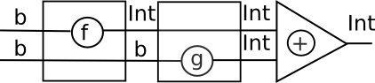

# Sygnały i programowanie reaktywne

* Systemy hybrydowe: elementy analogowe (ciągłe) i cyfrowe (dyskretne)

* Sygnały: wartości zmienne w czasie

* Przetworniki sygnałów (SF)

```
Signal a ~ Time -> a
SF a b   ~ Signal a -> Signal b
```

(historycznie: Hallgren, Carlsson 1995: użycie procesorów strumieni
 do programowania GUI w Haskellu)

~~~~ {.haskell}
data SP a b = Put b (SP a b) | Get (a -> SP a b)
~~~~

# Przetworniki


# Strzałki

* `instance Monad m c`: obliczenie o wyniku typu `c`

* `instance Arrow a b c`: obliczenie przetwarzające `a` na `b`

Pierwsze przybliżenie (Hughes 2000 ``Generalising monads to arrows'')

~~~~ {.haskell}
class Arrow a where
    arr   :: (b->c) ->  a b c
    (>>>) :: a b c -> a c d -> a b d
~~~~

Dla dowolnej monady `m`, funkcje `a -> m b` są dobrymi kandydatami:

~~~~ {.haskell}
newtype Kleisli m a b = K(a -> m b)

instance Monad m => Arrow (Kleisli m) where
  arr f       = K $ return . f
  K f >>> K g = K $ f >=> g

(>=>)       :: Monad m => (a -> m b) -> (b -> m c) -> (a -> m c)
f >=> g     = \x -> (f x >>= g)

~~~~

# Problem

Obliczenie sumujące wyniki dwóch obliczeń

~~~~ {.haskell}
add1 :: Monad m => m Int -> m Int -> m Int 
add1 mx my = mx >>= \x-> my >>= \y -> return $ x+y
-- liftM2 (+)
~~~~

Jak to wyrazić przy pomocy strzałek?

~~~~ {.haskell}
add2 :: Arrow a => a b Int -> a b Int -> a b Int
~~~~

`arr (+)` ?

~~~~ {.haskell}
addInt :: Int -> Int -> Int
addInt = (+)

> :t arr addInt
arr addInt :: Arrow a => a Int (Int -> Int)
~~~~

Bramki z jednym wejściem są za słabe...

# Pomysł

~~~~ {.haskell}
add2 :: Arrow a => a b Int -> a b Int -> a b Int
add2 f g = (?)
~~~~



Tak `f` jak i `g` potrzebują wejścia typu `b`.

* Rozdzielmy wejście na dwie kopie

* jedną podajmy do `f`, drugą zachowajmy

* zachowajmy wynik `f`, podając drugą kopię do `g`

* zsumujmy wyniki

# Demultiplekser

Zamiast dwóch wejść, możemy uzyc jednego, które jest parą...

...pod warunkiem, że potrafimy operować na składnikach niezależnie

~~~~ {.haskell}
class Arrow a where {- ... -}
    first :: a b c -> a (b,d) (c,d)
~~~~


~~~~ {.haskell}
    arr :: (b -> c) -> a b c
~~~~


~~~~ {.haskell}
(>>>) :: a b c -> a c d -> a b d
~~~~


# second?

Mamy `first` a gdzie jest second?

~~~~ {.haskell}
second :: a b c -> a (d, b) (d, c)
second f = arr swap >>> first f >>> arr swap 
  where swap (x,y) = (y,x)
~~~~


# `first f >>> second g`

Teraz możemy przetwarzać obie składowe:

~~~~ {.haskell}
(***)   :: a b c -> a b' c' -> a (b, b') (c, c')
f *** g = first f >>> second g

(&&&) :: Arrow a => a b c -> a b c' -> a b (c, c')
f &&& g = arr dup >>> (f *** g)
  where dup x = (x,x)
                
add2 :: Arrow a => a b Int -> a b Int -> a b Int
add2 f g = (f &&& g) >>> arr (\(u,v) -> u + v)
                           -- uncurry (+)
~~~~


# Kombinatory parsujące

~~~~ {.haskell}
-- Swierstra & Duponcheel LL(1) parsers

-- static info: nullable, First
data StaticParser s = SP { spNullable :: Bool, spFirst :: [s] } 

newtype DynamicParser s a = DP([s] -> (a,[s]))
data Parser s a = P (StaticParser s)(DynamicParser s a)

symbol :: s -> Parser s s
symbol s = P (SP False [s]) (DP (\(x:xs) -> (s,xs)))
-- Wywołane tylko gdy pierwszym symbolem jest s

(<|>) :: Eq s => Parser s a -> Parser s a -> Parser s a
(P (SP nul1 first1) (DP p1)) <|> (P (SP nul2 first2) (DP p2)) =
  P (SP (nul1 || nul2) (first1++first2)) (DP p) where
    p xs = case xs of
      []     -> if nul1 then p1 [] else p2 []
      (y:ys) -> if y `elem` first1 then p1 xs else   
                if y `elem` first2 then p2 xs else
                if nul1 then p1 xs else p2 xs
~~~~

# Problem: >>= ?

Jak zdefiniować

~~~~ {.haskell}
(>>=) :: Parser s a -> (a -> Parser s b) -> Parser s b 
~~~~

Problem: ''statyczna'' informacja o parserze wynikowym nie jest statyczna,
gdyż zalezy od pierwszego parsera.

Przypomnijmy, podobny problem był z


~~~~ {.haskell}
newtype Accy o a = Acc{acc::o}
(>>=) :: Accy o a -> (a->Accy o b) -> Accy o b
~~~~

# Rozwiązanie 1: Applicative

Zamiast `Monad` można uzyć `Applicative`:

~~~~ {.haskell}
<*> :: (Parser s (a->b)) -> Parser s a -> Parser s b
(P (SP nul1 first1) (DP pf)) <|> (P (SP nul2 first2) (DP pa)) = 
  P (SP (nul1&&nul2) first) (DP p) where 
    first = if nul1 then first1 ++ first2 else first1
    p = ...

pure :: a -> Parser s a
pure = ...
~~~~

**Ćwiczenie:** uzupełnij powyższą definicję

**Bonus:** wykorzystaj `first` oraz `(&&&)`

# Rozwiązanie 2: Arrow

~~~~ {.haskell}
class Arrow a where
    arr   :: (b->c) ->  a b c
    (>>>) :: a b c -> a c d -> a b d
    first :: a b c -> a (b,d) (c,d)

instance Eq s => Arrow (Parser s) where
   arr f = P (SP True []) (arr f)
   
   (P (SP nul1 first1) dp1) >>> (P (SP nul2 first2) dp2) =
     P (SP (nul1 && nul2) (union first1 first2)) (dp1 >>> dp2) 
     
   first (P sp dp) = P sp (first dp)

instance Arrow (DynamicParser s) where ...
~~~~

**Ćwiczenie:** uzupełnij instancję dla `DynamicParser`

# ArrowZero, ArrowPlus

~~~~ {.haskell}
class Arrow a => ArrowZero a where
    zeroArrow :: a b c
   
instance Eq s => ArrowZero (Parser s) where
  zeroArrow = P (SP False []) zeroArrow
  
instance ArrowZero (DynamicParser s) where ...

class ArrowZero a => ArrowPlus a where
    -- | An associative operation with identity 'zeroArrow'.
    (<+>) :: a b c -> a b c -> a b c  
~~~~

**Ćwiczenie:** uzupełnij brakujące instancje

# Koniec

~~~~ {.haskell}

~~~~
