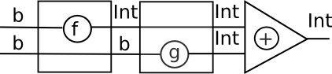
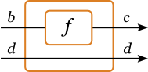
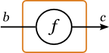
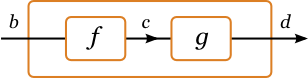
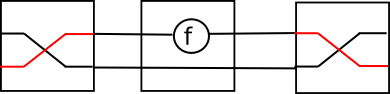

# Signals and reactive programming

* Hybrid systems: analog (continous) and digital (discrete) elements

* Signals: values varying with time

* Signal functions (SF)

```
Signal a ~ Time -> a
SF a b   ~ Signal a -> Signal b
```

(historically: Hallgren, Carlsson 1995: Fudgets - using stream processors for Haskell GUI programming)

~~~~ {.haskell}
data SP a b = Put b (SP a b) | Get (a -> SP a b)
~~~~

# Signal processors


# Arrows

* `instance Monad m c`: a computation with result type `c`

* `instance Arrow a b c`: a computation transforming `a` to `b`

First approximation (Hughes 2000 ``Generalising monads to arrows'')

~~~~ {.haskell}
class Arrow a where
    arr   :: (b->c) ->  a b c
    (>>>) :: a b c -> a c d -> a b d
~~~~


# Categories

~~~~ {.haskell}
class Arrow a where
    arr   :: (b->c) ->  a b c
    (>>>) :: a b c -> a c d -> a b d
~~~~


~~~~ {.haskell}
import qualified Prelude
class Category cat where
    id :: cat a a
    (.) :: cat b c -> cat a b -> cat a c
~~~~

For any monad  `m`, functions `a -> m b` are Kleisli arrows: 

~~~~ {.haskell}
newtype Kleisli m a b = K(a -> m b)

instance Monad m => Arrow (Kleisli m) where
  arr f       = K $ return . f
  K f >>> K g = K $ f >=> g

(>=>)       :: Monad m => (a -> m b) -> (b -> m c) -> (a -> m c)
f >=> g     = \x -> (f x >>= g)
~~~~

Exercise: 

~~~~ {.haskell}
instance Monad m => Category (Kleisli m)
~~~~


# Problem

A computation summing up results of other computationas

~~~~ {.haskell}
add1 :: Monad m => m Int -> m Int -> m Int 
add1 mx my = mx >>= \x-> my >>= \y -> return $ x+y
-- liftM2 (+)
~~~~

How to express this with arrows

~~~~ {.haskell}
add2 :: Arrow a => a b Int -> a b Int -> a b Int
~~~~

`arr (+)` ?

~~~~ {.haskell}
addInt :: Int -> Int -> Int
addInt = (+)

> :t arr addInt
arr addInt :: Arrow a => a Int (Int -> Int)
~~~~

Gates with one input seem to weak...

# An Idea

~~~~ {.haskell}
add2 :: Arrow a => a b Int -> a b Int -> a b Int
add2 f g = (?)
~~~~



Both `f` and `g` need input of type `b`.

* Make two copies of the input

* one goes to `f`, other kept for now

* keep the result of `f`, passing the second input copy to `g`

* sum up the results

# Demultiplexer

Instead of two inputs, we might use one input being a pair...

...as long as we can operate on its components independently

~~~~ {.haskell}
class Arrow a where {- ... -}
    first :: a b c -> a (b,d) (c,d)
~~~~




NB, this function is tremendously useful even without full arrows, used at the type

~~~~ {.haskell}
    first ::  b -> c -> (b,d) -> (c,d)
~~~~

Exercise: implement first for Kleisli arrows

# Almost there


<!--

~~~~ {.haskell}
    arr :: (b -> c) -> a b c
~~~~



-->

~~~~ {.haskell}
(>>>) :: a b c -> a c d -> a b d
~~~~




~~~~ {.haskell}
almostAdd :: (b,b) -> a b Int -> a b Int -> a b Int
almostAdd = first f >>> second g >>> arr (uncurry +)
~~~~


# second?

We saw `first` but where is `second`?

~~~~ {.haskell}
second :: a b c -> a (d, b) (d, c)
second f = arr swap >>> first f >>> arr swap 
  where swap (x,y) = (y,x)
~~~~



# `first f >>> second g`

Now we can process both components:

~~~~ {.haskell}
(***)   :: a b c -> a b' c' -> a (b, b') (c, c')
f *** g = first f >>> second g

(&&&) :: Arrow a => a b c -> a b c' -> a b (c, c')
f &&& g = arr dup >>> (f *** g)
  where dup x = (x,x)
                
add2 :: Arrow a => a b Int -> a b Int -> a b Int
add2 f g = (f &&& g) >>> arr (\(u,v) -> u + v)
                           -- uncurry (+)
~~~~


# Parsing combinators

~~~~ {.haskell}
-- Swierstra & Duponcheel LL(1) parsers

-- static info: nullable, First
data StaticParser s = SP { spNullable :: Bool, spFirst :: [s] } 

newtype DynamicParser s a = DP([s] -> (a,[s]))
data Parser s a = P (StaticParser s)(DynamicParser s a)

symbol :: s -> Parser s s
symbol s = P (SP False [s]) (DP (\(x:xs) -> (s,xs)))
-- Called only when the first symbol is s

(<|>) :: Eq s => Parser s a -> Parser s a -> Parser s a
(P (SP nul1 first1) (DP p1)) <|> (P (SP nul2 first2) (DP p2)) =
  P (SP (nul1 || nul2) (first1++first2)) (DP p) where
    p xs = case xs of
      []     -> if nul1 then p1 [] else p2 []
      (y:ys) -> if y `elem` first1 then p1 xs else   
                if y `elem` first2 then p2 xs else
                if nul1 then p1 xs else p2 xs
~~~~

# Problem: >>= ?

How to define

~~~~ {.haskell}
(>>=) :: Parser s a -> (a -> Parser s b) -> Parser s b 
~~~~

Problem: ''static'' info about the result parser is not static, since it depends on the result 
of the first parser

Recall that we had a similar problem with


~~~~ {.haskell}
newtype Accy o a = Acc{acc::o}
(>>=) :: Accy o a -> (a->Accy o b) -> Accy o b
~~~~

# Solution 1: Applicative

Use `Applicative` instead of `Monad`  

~~~~ {.haskell}
<*> :: (Parser s (a->b)) -> Parser s a -> Parser s b
(P (SP nul1 first1) (DP pf)) <|> (P (SP nul2 first2) (DP pa)) = 
  P (SP (nul1&&nul2) first) (DP p) where 
    first = if nul1 then first1 ++ first2 else first1
    p = ...

pure :: a -> Parser s a
pure = ...
~~~~

**Exercise:** complete the definition above

**Bonus:** use `first` and`(&&&)` where appropriate

# Solution 2: Arrow

~~~~ {.haskell}
data StaticParser s = SP { spNullable :: Bool, spFirst :: [s] } 
newtype DynamicParser s a b = DP( (a,[s]) -> (b,[s]) )
data Parser s a b = P (StaticParser s)(DynamicParser s a b)

class Arrow a where
    arr   :: (b->c) ->  a b c
    (>>>) :: a b c -> a c d -> a b d
    first :: a b c -> a (b,d) (c,d)

instance Eq s => Arrow (Parser s) where
   arr f = P (SP True []) (arr f)
   
   (P (SP nul1 first1) dp1) >>> (P (SP nul2 first2) dp2) =
     P (SP (nul1 && nul2) (union first1 first2)) (dp1 >>> dp2) 
     
   first (P sp dp) = P sp (first dp)

instance Arrow (DynamicParser s) where ...
~~~~

**Exercise:** write an `Arrow` instance for  `DynamicParser`

# ArrowZero, ArrowPlus

~~~~ {.haskell}
class Arrow a => ArrowZero a where
    zeroArrow :: a b c
   
instance Eq s => ArrowZero (Parser s) where
  zeroArrow = P (SP False []) zeroArrow
  
instance ArrowZero (DynamicParser s) where ...

class ArrowZero a => ArrowPlus a where
    -- | An associative operation with identity 'zeroArrow'.
    (<+>) :: a b c -> a b c -> a b c  
~~~~

**Exercise:** complete missing instances

**Exercise:** write a parser for digit sequences:

~~~~ {.haskell}
parseInt :: Parser Char a Int
parseInt = arr (const 0) >>> parseInt'

parseInt' :: Parser Char Int Int
parseInt' = undefined
~~~~

# Arrow syntax


As monads do, also arrows have their own syntax sugar:

~~~~ {.haskell}
{-# LANGUAGE Arrows #-}
import Control.Arrow
addA :: Arrow a => a b Int -> a b Int -> a b Int
addA f g = proc x -> do
    y <- f -< x
    z <- g -< x
    returnA -< y + z
~~~~

translates too

~~~~ {.haskell}
addA f g = arr (\ x -> (x, x)) >>>
           first f >>> arr (\ (y, x) -> (x, y)) >>>
           first g >>> arr (\ (z, y) -> y + z)

returnA :: Arrow a => a b b
returnA = arr id
~~~~

we wrote `add` using `(&&&)` but the preprocessor is not smart enough
(similarly, preprocessor for monads does not use  `liftM2`
etc.)

# Databases

Opaleye - Tom Ellis,
 [http://staff.science.uva.nl/~grelck/nl-fp-talks/ellis.pdf](http://staff.science.uva.nl/~grelck/nl-fp-talks/ellis.pdf)

~~~~ {.haskell}
> people :: Table(PersonId, Name)
> favoriteFeature :: Table(PersonId, String)

> favourites :: Query String
> favourites = proc () -> do
>   -- Corresponding to SQL's 'FROM ...'
>   (pid, name) <- people -< ()
>   (pid', feature) <- favouriteFeature -< ()
> 
>   -- Corresponding to SQL's 'WHERE ... = ...'
>   restrict <<< eq -< (pid, pid')
> 
>   -- Corresponding to SQL's 'SELECT ...'
>   returnA -< name ++ "'s favourite feature is " ++ feature

~~~~

# Running it

~~~
*Main Control.Arrow> display favourites
Tom's favourite feature is arrows
Duncan's favourite feature is cabal
Simon's favourite feature is purity
~~~

#  Under thre hood

~~~~ {.haskell}
> type QueryArr = Kleisli [] -- fake DB with lists
> instance Arrow QueryArr where
> type Query = QueryArr ()
> type Table = Query

> display :: Query String -> IO ()

> eq :: Eq a => QueryArr (a,a) Bool
> eq =  eq = arr $ uncurry (==)

> restrict :: QueryArr Bool ()
> restrict = Kleisli guard
>   where guard = \cond -> if cond then [()] else []
~~~~

Not many details, Opaleye is not open source :(

[http://www.haskell.org/pipermail/haskell-cafe/2014-March/113253.html](http://www.haskell.org/pipermail/haskell-cafe/2014-March/113253.html)

# Koniec

~~~~ {.haskell}

~~~~
